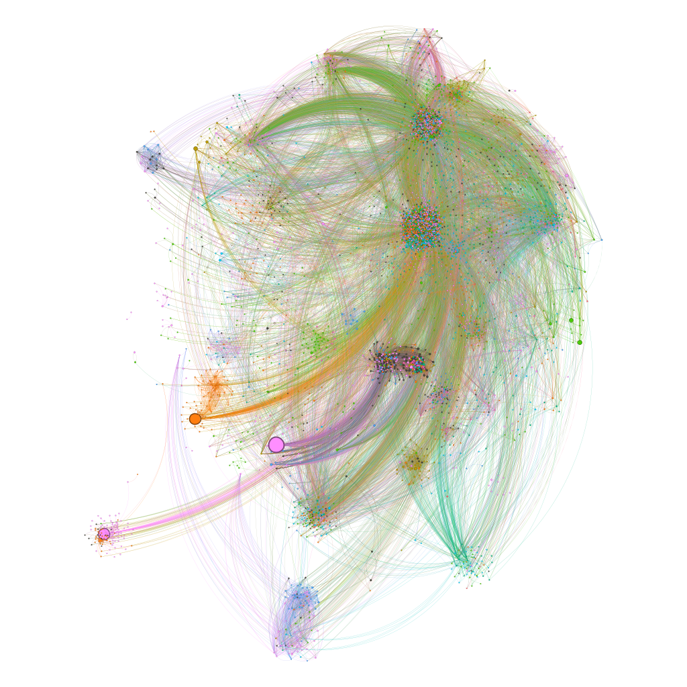

# Advanced Network Mining and Graph Analysis of the Tor Ecosystem

**Trust in Tor: Are the Hidden Services trustable?**

## About This Project
This presentation provides a technical deep-dive into the infrastructure, cryptographic architecture, Natural Language Processing (NLP) enrichment pipelines, and graph-theoretic analysis of the anonymous web. It explores how to infer credibility and separate legitimate privacy-preserving services from scams and criminal ecosystems in a space that lacks built-in trust signals like search rankings or SSL certificates.

Presented at **Code & Coffee Urmia – May 2026** by **Mir Saman Tajbakhsh**.

## Key Themes & Methodology

### 1. The Threat Landscape
* **Historical Context:** Overview of the Tor network's evolution from its origins in the U.S. Naval Research Laboratory to its modern maturity.
* **Deanonymization & Law Enforcement:** Analysis of major darknet takedowns (e.g., Silk Road, AlphaBay, Operation Alice), demonstrating that operator OPSEC failures and blockchain forensics are the primary vectors for disruption, rather than core Tor protocol vulnerabilities.

### 2. Data Acquisition & Crawling Architecture
* **Clearnet vs. Darknet:** Outlines the stark differences in latency, uptime reliability, and discovery mechanisms between standard web crawling and .onion crawling.
* **Scalable Architecture:** Details a Layered Proxy Architecture using HAProxy, multiple Privoxy instances, and isolated Tor instances to overcome throughput bottlenecks, handle "instance flapping," and manage connection timeouts.

### 3. NLP Integration & Automated Classification
* **Language Detection:** Handling the heavily multilingual nature of the Tor ecosystem using tools like fastText to gate downstream NLP tasks.
* **ANITA Classification:** Utilizing an uncensored LLM to automatically categorize darknet services (e.g., Markets, Financial Services, Hacking Services) and generate descriptive snippets, avoiding the limitations of censored models when analyzing illicit topics.

### 4. Graph Theory & Network Topology
* **Network Modeling:** Treating the Tor network as a directed graph to surface hidden authorities and tightly linked communities.
* **Algorithms Used:**
    * **PageRank & HITS:** To identify authoritative hubs and directories.
    * **Louvain Method:** For community detection, clustering nodes into thematic ecosystems (e.g., hacker forums, marketplace networks).
    * **OpenOrd:** A force-directed layout algorithm used in Gephi to visually separate communities and highlight dense groups.

## Key Observations
Graph topology serves as a powerful detection signal. For instance:
* **Scam Networks:** Exhibit high out-degree and low in-degree (aggressively linking outward but rarely cited by established services).
* **Operational Criminal Networks:** Exhibit high in-degree from trusted referrers and minimal out-linking, heavily embedded in the core of the network.

## Ethical & Legal Considerations
Research involving darknet crawling operates under strict constraints. All methodologies adhere to the Menlo Report framework, emphasizing respect for law, public interest, and safe data handling (e.g., avoiding the storage of illicit materials).
